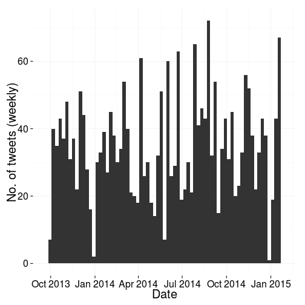
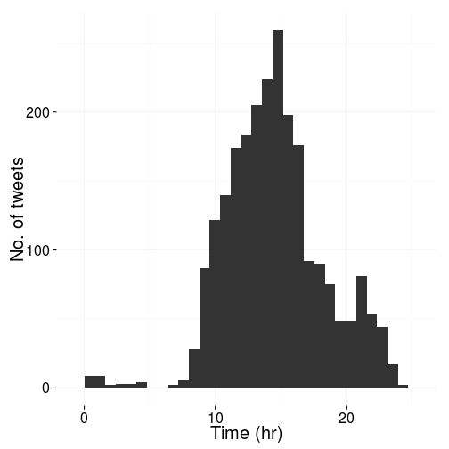
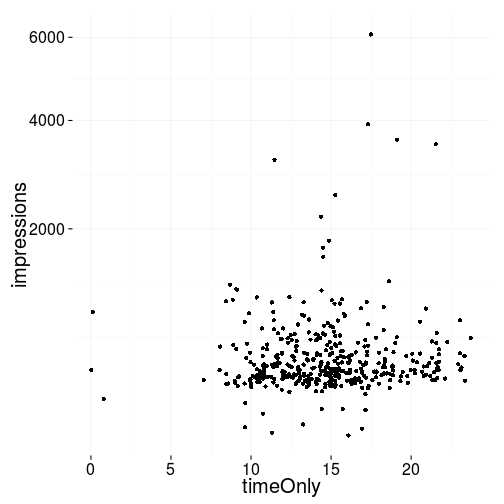
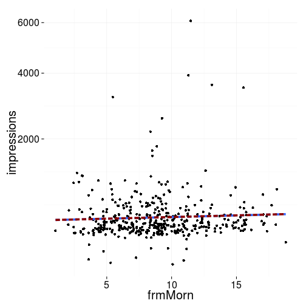

# Lets look at twitter data!

## Preamble: Load libs, read data

```r
library(ggplot2)
library(reshape2)
library(dplyr)
library(magrittr)
library(lubridate)
```


```r
setwd('~/Dropbox/Documents/statsforbios/twitterData')
d <- read.csv('tweet_activity_metrics0121.csv', stringsAsFactors = FALSE)

dim(d)
```

```
## [1] 2388   40
```

```r
names(d)
```

```
##  [1] "Tweet.id"                       "Tweet.permalink"               
##  [3] "Tweet.text"                     "time"                          
##  [5] "impressions"                    "engagements"                   
##  [7] "engagement.rate"                "retweets"                      
##  [9] "replies"                        "favorites"                     
## [11] "user.profile.clicks"            "url.clicks"                    
## [13] "hashtag.clicks"                 "detail.expands"                
## [15] "permalink.clicks"               "embedded.media.clicks"         
## [17] "app.opens"                      "app.installs"                  
## [19] "follows"                        "email.tweet"                   
## [21] "dial.phone"                     "video.views"                   
## [23] "promoted.impressions"           "promoted.engagements"          
## [25] "promoted.engagement.rate"       "promoted.retweets"             
## [27] "promoted.replies"               "promoted.favorites"            
## [29] "promoted.user.profile.clicks"   "promoted.url.clicks"           
## [31] "promoted.hashtag.clicks"        "promoted.detail.expands"       
## [33] "promoted.permalink.clicks"      "promoted.embedded.media.clicks"
## [35] "promoted.app.opens"             "promoted.app.installs"         
## [37] "promoted.follows"               "promoted.email.tweet"          
## [39] "promoted.dial.phone"            "promoted.video.views"
```


```r
theme_set(theme_minimal(base_size = 20))
```


## Some basic time stuff

Number of tweets has remained relatively constant of the period.


```r
d$time %<>% as.POSIXct
ggplot(d, aes(x = time)) +
  geom_histogram(bin = 7*24*60*60) +
  ylab('No. of tweets (weekly)') +
  xlab('Date')
```

 

Most of my tweets are between 10 and 5 GMT. Quite a few in the evening as well.


```r
d$timeOnly <- hour(d$time) + minute(d$time)/60

ggplot(d, aes(x = timeOnly)) + 
  geom_histogram() +
  ylab('No. of tweets') +
  xlab('Time of day')
```

```
## stat_bin: binwidth defaulted to range/30. Use 'binwidth = x' to adjust this.
```

 


## Time regressions

Time of day is marginally significant, but not much there.

```r
lm(d$impressions ~ d$timeOnly) %>% summary
```

```
## 
## Call:
## lm(formula = d$impressions ~ d$timeOnly)
## 
## Residuals:
##    Min     1Q Median     3Q    Max 
## -138.7 -107.1  -96.6  -59.6 5959.4 
## 
## Coefficients:
##             Estimate Std. Error t value Pr(>|t|)  
## (Intercept)   53.557     23.376   2.291   0.0220 *
## d$timeOnly     3.552      1.558   2.279   0.0227 *
## ---
## Signif. codes:  0 '***' 0.001 '**' 0.01 '*' 0.05 '.' 0.1 ' ' 1
## 
## Residual standard error: 287.4 on 2386 degrees of freedom
## Multiple R-squared:  0.002173,	Adjusted R-squared:  0.001755 
## F-statistic: 5.195 on 1 and 2386 DF,  p-value: 0.02273
```

```r
ggplot(d, aes(x = timeOnly, y = impressions)) +
  geom_point() +
  scale_y_sqrt()
```

 
However I think it's slightly better to do from 7am.

```r
d$frmMorn <- d$timeOnly - 6
d$frmMorn[d$frmMorn < 0] <- d$frmMorn[d$frmMorn < 0] + 24 

ggplot(d, aes(x = frmMorn)) + 
  geom_histogram()
```

```
## stat_bin: binwidth defaulted to range/30. Use 'binwidth = x' to adjust this.
```

 

```r
ggplot(d, aes(x = frmMorn, y = impressions)) +
  geom_point() +
  scale_y_sqrt() +
  stat_smooth(method = 'lm', se = FALSE, size = 1.7, linetype = '22') + 
  stat_smooth(method = 'glm', family = 'quasipoisson', colour = 'red4', se = FALSE, size = 1.7, linetype = '21')
```

 

```r
lm(d$impressions ~ d$frmMorn) %>% summary
```

```
## 
## Call:
## lm(formula = d$impressions ~ d$frmMorn)
## 
## Residuals:
##    Min     1Q Median     3Q    Max 
## -141.7 -106.2  -98.2  -61.4 5962.8 
## 
## Coefficients:
##             Estimate Std. Error t value Pr(>|t|)    
## (Intercept)   81.827     15.213   5.379 8.24e-08 ***
## d$frmMorn      2.641      1.590   1.661   0.0969 .  
## ---
## Signif. codes:  0 '***' 0.001 '**' 0.01 '*' 0.05 '.' 0.1 ' ' 1
## 
## Residual standard error: 287.5 on 2386 degrees of freedom
## Multiple R-squared:  0.001154,	Adjusted R-squared:  0.0007359 
## F-statistic: 2.758 on 1 and 2386 DF,  p-value: 0.09691
```

```r
glm(d$impressions ~ d$frmMorn, family = 'quasipoisson') %>% summary
```

```
## 
## Call:
## glm(formula = d$impressions ~ d$frmMorn, family = "quasipoisson")
## 
## Deviance Residuals: 
##     Min       1Q   Median       3Q      Max  
## -17.135  -14.537  -14.010   -6.606  191.377  
## 
## Coefficients:
##             Estimate Std. Error t value Pr(>|t|)    
## (Intercept)  4.43585    0.14445  30.708   <2e-16 ***
## d$frmMorn    0.02439    0.01455   1.676   0.0939 .  
## ---
## Signif. codes:  0 '***' 0.001 '**' 0.01 '*' 0.05 '.' 0.1 ' ' 1
## 
## (Dispersion parameter for quasipoisson family taken to be 771.5242)
## 
##     Null deviance: 840263  on 2387  degrees of freedom
## Residual deviance: 838137  on 2386  degrees of freedom
## AIC: NA
## 
## Number of Fisher Scoring iterations: 7
```
Linear model is no longer significant. I don't think there's anything here. 

## Follows

Not too much interesting with by looking at tweets I got follows from.

```r
follows <- d %>% filter(follows > 0)
dim(follows)
```

```
## [1]  9 42
```


